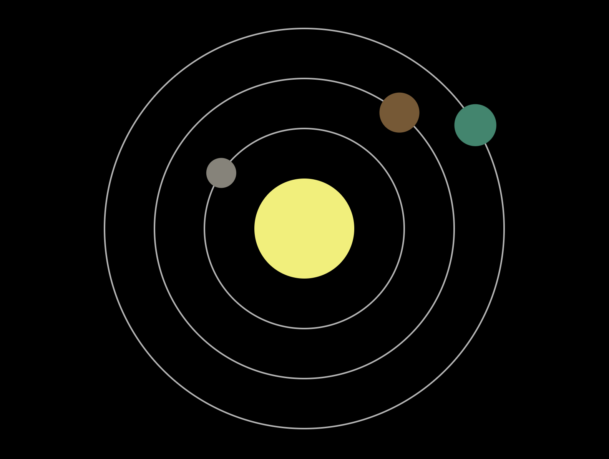
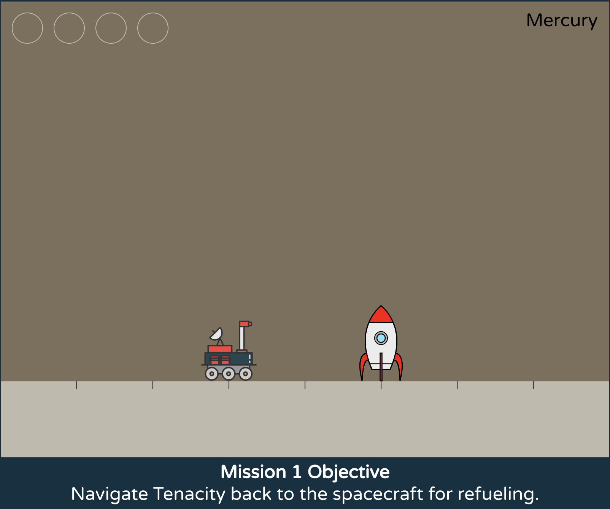
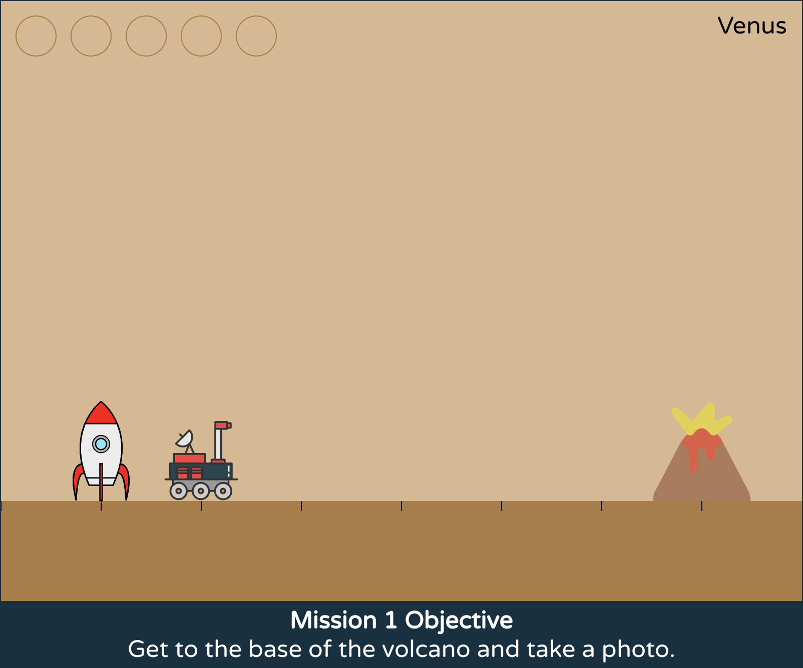

# Tenacity

A game based on the principles of computer programming.

**Play the game at <https://tenacity.brianyu.me/>**

## Gameplay

The game follows a rover named Tenacity as it travels across four planets: Mercury, Venus, Earth, and Mars. On each planet, Tenacity needs your help to complete its missions. Program Tenacity by giving it instructions to follow to help it achieve each of its objectives.

Each planet is focused on one new computational thinking principle.

* On **Mercury**, players are introduced to **functions**.
* On **Venus**, players are introduced to **loops**.
* On **Earth**, players are introduced to **conditions**.
* On **Mars**, players are introduced to **variables**.

## Contact

I'm [Brian Yu](https://brianyu.me/), and I developed
Tenacity as part of a project at
Harvard's Graduate School of Education.
I would love to hear your thoughts and feedback on the experience: you can reach me at
<brian@brianyu.me>.

